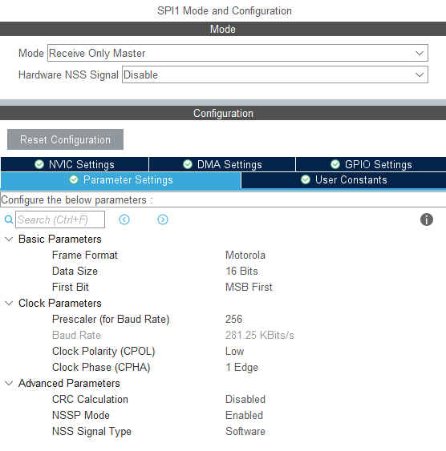

# MAX6675 STM32 Library 

> MAX6675 thermocouple drivers made for the STM32 microcontroller. This was tested using the Nucleo-F746ZG development board, but it *should* work across different STM32 variants. 


### Setup 

In the STM32CubeMX interface, configure the SPI that is going to be used for the SCK (serial clock) and MISO (master in/slave out) pins. I'll be using SPI1.



We also need to define a `GPIO_Output` to send the CS (chip/slave select) signal, which I'll set to `PA7`. `SPI1_SCK` and `SPI1_MISO` can be assigned to `PA5` and `PA6` pins respectively. If you need to connect multiple sensors to the same SPI1 signals, you can just reuse the same `SPI1_SCK` and `SPI1_MISO` lines, and just introduce a new `GPIO_Output` for the new sensor. 


---

### Example 

```
int main(void)
{
    max6675_tc* sensor; 
    sensor = tc_init(GPIOA, GPIO_PIN_7); 

    /*
    ...
    auto-generated system configs
    ...
    */
    
    while (1) 
    {
        float temp = tc_readTemp(sensor); 
        uint8_t* buffer_tx[64];
	    sprintf((char*)buffer_tx, "Temperature: %.0fC\r\n", temp);
	    HAL_UART_Transmit(&huart3, buffer_tx, strlen((char*)buffer_tx), 1000);
        HAL_Delay(100); 
    }
}

```
